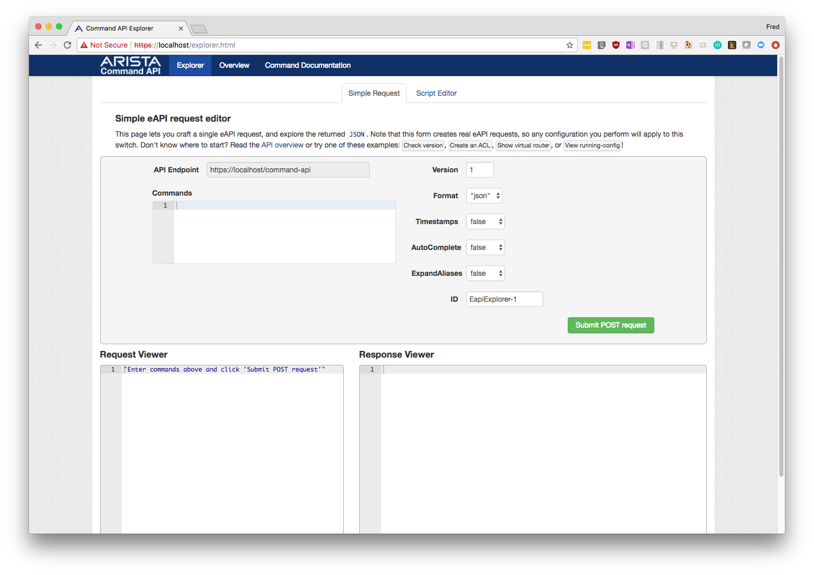

# Using cEOS as a network simulator on your laptop
This article will show how you to import and run cEOS (Containerized EOS) on your laptop with Docker.  I will be using Mac OS X as my base operating system, but this should work in other environments that support Docker.  I'm going to assume that you already have Docker installed and running, if you need instructions have a look here: https://docs.docker.com/engine/installation/

First you'll need to download the cEOS-lab image from the arista.com software downloads page.  After downloading the cEOS image, you'll need to import it into your Docker image repository.  You do this with the `docker import` command:

    docker import cEOSLab.tar.xz ceosimage:latest

With the above command we've told Docker to import the image, name the image `ceosimage` and tag it as `latest`

This will take a few seconds, then we can see that we have the image imported:

    $ docker images
    REPOSITORY                       TAG                 IMAGE ID            CREATED             SIZE
    ceosimage                        latest              58527015d214        6 minutes ago       1.38GB

Now let's create a cEOS container:

    $ docker create --name=ceos --privileged -p 443:443 -e CEOS=1 -e container=docker -e EOS_PLATFORM=Docker -e SKIP_ZEROTOUCH_BARRIER_IN_SYSDBINIT=1 -e ETBA=1 -e INTFTYPE=eth -it ceosimage:latest /sbin/init
    4f716c85d9ed3ebd64952499252c59d4303d3131efb398aaec80b330b3110727

Let's look at all the parameters provided:

* `--name=eos` - Create a container with the name eos
* `--privileged` - Run the container in privileged mode allowing 
* `-p 443:443` - expose port 443 for eAPI access as port 443 on the host
* `-e CEOS=1` - Tells EOS this is a cEOS and not standard EOS
* `-e container=docker` - Letting 
* `-e EOS_PLATFORM=Docker` - Letting EOS know we're using the Docker runtime
* `-e SKIP_ZEROTOUCH_BARRIER_IN_SYSDBINIT=1` - skip ZTP on bootup
* `-e ETBA=1`  - Use a software based dataplane
* `-e INTFTYPE=eth` - How the underlying OS labes the Ethernet interfaces
* `-it` - Docker commands for interactive terminal
* `ceosimage:latest` - the image we're using
* `/sbin/init` - the command you start the container with, in this case we're starting the `init` executable

The value it returns is the *container ID* of the container created.  We can see the new container with `docker ps -a`.  We have to pass it the `-a` switch to display *all* containers, since by default it only shows ones that are actively running:

    $ docker ps -a
    CONTAINER ID        IMAGE               COMMAND             CREATED             STATUS              PORTS               NAMES
    4f716c85d9ed        ceosimage:latest    "/sbin/init"        10 seconds ago      Created                                 ceos

It would be pretty boring to have cEOS with no network interfaces, so let's create a couple networks and attach them to the container:

    $ docker network create net1
    1f9e80a939a822a4b0edc41e67a714633e1a5e518bee551e66375cb0df29197e
    $ docker network create net2
    7e992da246abb49902a8d0f58982c98bd85c5bb015d8bc57677754a89c17d4cb
    $ docker network connect net1 ceos
    $ docker network connect net2 ceos

    $ docker start ceos
    ceos

    $ docker ps
    CONTAINER ID        IMAGE               COMMAND             CREATED             STATUS              PORTS                  NAMES
    4f716c85d9ed        ceosimage:latest    "/sbin/init"        2 minutes ago       Up 17 seconds       0.0.0.0:443->443/tcp   ceos

Now you can login to the container by executing the Cli: `docker exec -it ceos Cli` and get to the CLI (*Note* if you do this too quickly it may not give you a prompt right away and you may see some log messages as the container is still booting):

    $ docker exec -it ceos Cli
    localhost login: admin
    localhost> en
    localhost#sho run
    ! Command: show running-config
    ! device: localhost (cEOS, EOS-4.19.0F-5984698.regmiberlineft4ceos0 (engineering build))
    !
    transceiver qsfp default-mode 4x10G
    !
    spanning-tree mode mstp
    !
    no aaa root
    !
    interface Ethernet1
    !
    interface Ethernet2
    !
    no ip routing
    !
    end
    localhost#
    localhost#show ver
    Arista cEOS
    Hardware version:
    Serial number:
    System MAC address:  0242.ac5b.5660

    Software image version: 4.19.0F-5984698.regmiberlineft4ceos0 (engineering build)
    Architecture:           i386
    Internal build version: 4.19.0F-5984698.regmiberlineft4ceos0
    Internal build ID:      66a79d2a-4503-4ffd-b3c8-9b43cc8a40c4

    cEOS tools version: 0.1

    Uptime:                 5 hours and 11 minutes
    Total memory:           2047032 kB
    Free memory:            1074556 kB

I'm going to turn on eapi and set the admin username:

    localhost#conf t
    localhost(config)#username admin secret admin
    localhost(config)#management api http-commands
    localhost(config-mgmt-api-http-cmds)#no shut
    localhost(config-mgmt-api-http-cmds)#end

To get out of the container type `ctrl-p` `ctrl-q`

You can also use `docker exec` to run commands in the container and give you the output:

    $ docker exec -it ceos Cli -c "show version"
    Arista cEOS
    Hardware version:
    Serial number:
    System MAC address:  0242.ac5b.5660

    Software image version: 4.19.0F-5984698.regmiberlineft4ceos0 (engineering build)
    Architecture:           i386
    Internal build version: 4.19.0F-5984698.regmiberlineft4ceos0
    Internal build ID:      66a79d2a-4503-4ffd-b3c8-9b43cc8a40c4

    cEOS tools version: 0.1

    Uptime:                 5 hours and 55 minutes
    Total memory:           2047032 kB
    Free memory:            1048420 kB

    $ docker exec -it ceos Cli -c "show interfaces status"
    Port       Name        Status       Vlan     Duplex Speed  Type            Flags
    Et1                    connected    1        full   unconf EbraTestPhyPort
    Et2                    connected    1        full   unconf EbraTestPhyPort

And since we enabled eAPI and exposed port 443, we can browse to the eAPI by going to https://localhost :

As you can see, with cEOS we are able to quickly create EOS containers to model an Arista switch or as a tool for API testing.  Hopefully this will be helpful in your lab and dev environments.